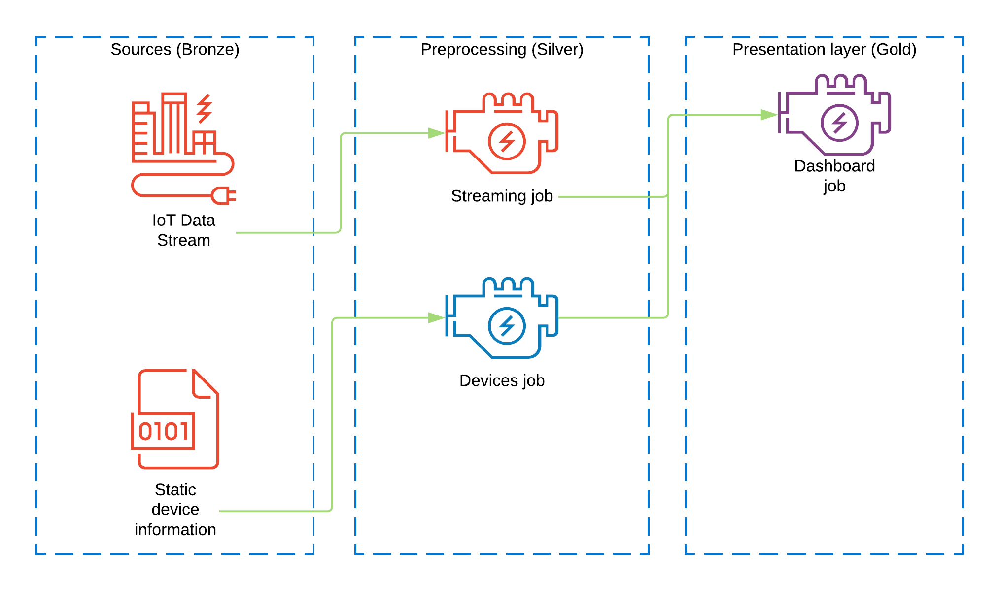
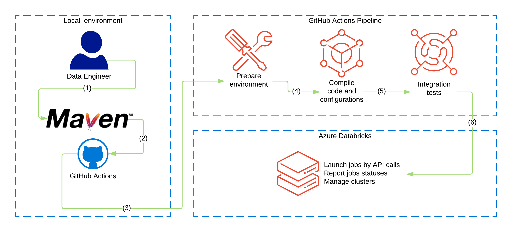

# Databricks jobs configuration via jsonnet

An example of how to use jsonnet together with Databricks Jobs API to launch multiple jobs with interdependent configurations.

To get more details on implementation, please check GitHub Actions page and `/src/main/jsonnet` directory.

# Data pipeline

# CI/CD pipeline

